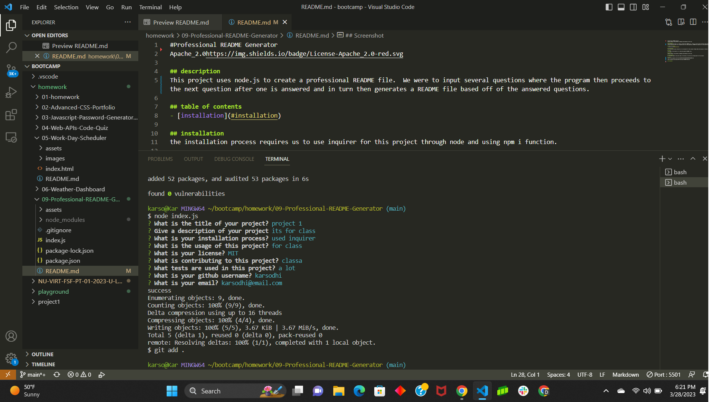

#Professional README Generator
Apache_2.0https://img.shields.io/badge/License-Apache_2.0-red.svg

## description
This project uses node.js to create a professional README file.  We were to input several questions where the program then proceeds to the next question after one is answered and in turn then generates a README file based off of the answered questions.

## table of contents
- [installation](#installation)

## installation
the installation process requires us to use inquirer for this project through node and using npm i function.

## usage
the usage of this project is to create and generate README files.

## license
Apache_2.0https://img.shields.io/badge/License-Apache_2.0-red.svg

## contributing
we installed inquirer and wrote code in the index.js file that runs through node for this project.

## Links
https://drive.google.com/file/d/1O5yfBkETcbEKnyQE8Wv2BHMVn0TDw6M0/view

https://github.com/karsodhi/09-Professional-README-Generator

# Screenshots

